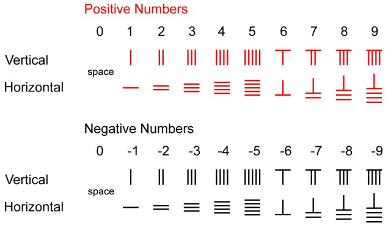
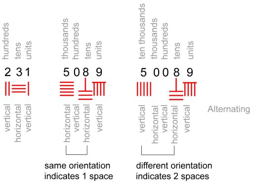

# Lesson 2: Integers, Powers and Roots

## Integers 

Integers are formed by the set of natural numbers plus the negative numbers. To understand what are integers, first let's understand why they started to be necessary in our daily life. It was not so long ago that negative numbers were included in arithmetic problems here, in the western world. Until the 19th century the negative numbers where considered as natural numbers which where part of aritmetic operations of subtraction. They where not considered independently as we use them nowadays. Perhaps this is a good thing! You will soon understand why. 

The Chineses, since 200 BCE (Before Common Era) were already using negative numbers to calculate taxes and commercial operations. To identify negative numbers they used colors - red for positive numbers and black for negative numbers. See the image below:

> 
 Figure 1: Chinese Rod Numbers 

 

This symbology for numbers used in China is called "Chinese Rod Numbers". The horizontal and vertical paterns associated with each number is meant for writing them together, laterally, alternating horizontal and vertical patterns. See the example bellow:

{:refdef: style="text-align: center;"}

{: refdef}
> 
 Figure 2: Numbers 231, 5089 and 50089, respectively. 

    

Observe the last number and how the zeros are represented. If only one zero were inside of the blank space, the number 8 should be represented vertically, not horizontally, so, by deduction you find that there are two zeros at the blank space between 5 and 8. Interesting, right? 

In the daily life, positive and negative numbers are used to represent earnings and debts. For example: let's say that you are selling apples. The apple costs 1 Euro each. John, your neighbor comes and buys 5 apples. You earn 5 Euro and John has less 5 Euro in his pocket. If John cannot pay you at that moment, he will be in debt of 5 Euro and you will take note in your notebook associating John with 5 black rods. Like this:

> My notebook:      
> neighbor John - IIIII      
> Mary - IIIII      
> Peter - III      
> --------------------------------------------    
> Total - III    
     

In this day you have a positive balance. You earned three Euro. Nice! So, notice that the red symbols cancel the black ones.

Let's now see graphically how this information could be represented. For this, follow this [link](https://github.com/raquelsilva/programming_for_teens/blob/master/Integers.ipynb) to access one of the notebooks.

<code class="highlighter-rouge">References:</code>

English Mathematicians
Francis Maseres (1731 - 1824)
A dissertation on the use of the negative sign in algebra. (1758)
Fellow of Clare College Cambridge and Fellow of the Royal Society

https://nrich.maths.org/5961

Needham, J. (1986). Science and Civilization in China: Volume 3, Mathematics and the Sciences of the Heavens and the Earth. Taipei: Caves Books, Ltd.

https://grahamshawcross.com/2014/02/06/five-finger-exercises/

## Powers and Square Roots

One time my son asked me: 'Mom, what is square root?"; and I noticed that I had memorized some values, I vaguely remembered how to calculate it without the help of a calculator but, what made me mistified was that I didn't really knew what a square root actually is. Intrigued by this observation I started to ask some collegues ( masters and PhD's) if they knew what a square root is but the same as me, they had memorized some operations and that was all. Well, at least the problem was not only with me :)
After thinking a while I started to see a light by analysing the name "square root". In portuguese the translation doesn't really means what it is written in English. In Brazil we say, instead, "root square". This seems to be a detail but for me it makes a huge diferrence in the understanding of this matter. But even for peopleo who talk English this subject it is not completely disclosed. For example, I searched at the internet using the question: "What is square root?" and I mostly find the same response, only aome arithmetical explanation. But we are talking about squares!!! So, where are the squares?; why are they important?; and what is the root of a square? I found the answer in a website for children, very interesting called "Math is fun". And yes, I agree with them!
First I was thinking that I was spacing out with my observations, but when I found someone else talking the same thing I thought that this really worth to be shared.
