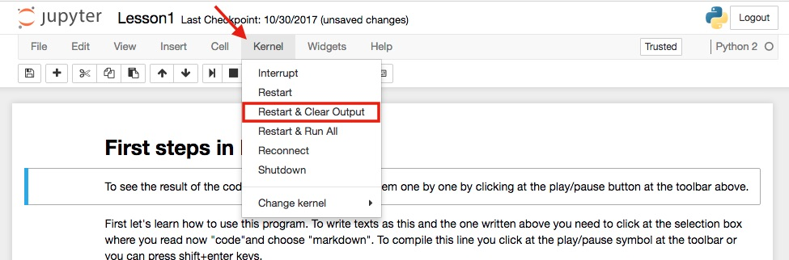

<h1>Studying interactively with Python</h1>

Lessons based on the Cambridge lower secondary curriculum for teenagers from 11 up to 15 years old. 

  <ul>
    <li><b>First Lesson:</b> Instalation and basic instructions about Jupyter notebook and Python.</li>
    <li><b>Second Lesson:</b> Integers, Powers and Roots - with an example of algorithm to calculate compound interest.</li>
  </ul>  

As new classes are being added the list above will be updated.

The content exhibited at the website is slightly different from the content available at the notebooks. I am using this feature to make it more interesting for teenagers. But if you want to interact with the codes it is necessary to download the notebooks and follow the instructions.

The first instruction is: download the package Anaconda to be able to interact with the codes. You can use this <a href="https://www.anaconda.com">link</a>. After the installation, you need to launch the module named "Jupyter Notebook". If you only need to see the content inside of the notebooks you just need to click on the files listed at the github or you can open it using an external viewer named "nbviewer". You can find it using this <a href="https://nbviewer.jupyter.org">link</a>. To open the notebook, copy and paste the address of the page.

You can create a new notebook and add only the codes you are interested to test or you can use the notebooks I have created by restarting the  "Kernel" at the upper toolbar. Look at the <a href="https://github.com/raquelsilva/programming_for_teens/wiki/First-step">wiki</a> how to do it.

If you have questions, feel invited to contact me.

